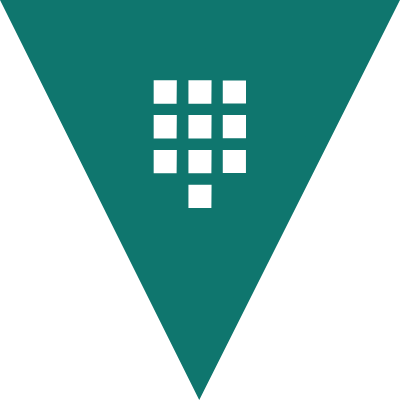

# Vaultfolio

<p align="center">
  
</p>

[](https://sonarcloud.io/summary/new_code?id=mallwang_vaultfolio)
[](https://sonarcloud.io/summary/new_code?id=mallwang_vaultfolio)
[](https://sonarcloud.io/summary/new_code?id=mallwang_vaultfolio)

**[English version](README.md)**

Eine persönliche Finanzanwendung – Frontend, Backend und Datenbank, verpackt und betrieben als
Docker-Container.

Vaultfolio ist um unabhängige Domänen organisiert (siehe
[Frontend-Domänenbibliothek-Architektur](#frontend-domänenbibliothek-architektur)). **Holdings** –
die Verfolgung _deiner Anlagen_ (ETFs, Aktien, Gold und weitere Positionen) – ist die erste,
vollständig ausgebaute Domäne. Sie verbindet sich nicht mit Bank- oder Broker-APIs; alle Daten
werden manuell über die Oberfläche eingegeben, mit CSV/JSON-Import als Komfort für die
Massenerfassung. Geplante Domänen erweitern die Anwendung über das Anlagetracking hinaus zu
einer umfassenden Finanzverwaltungs-App: Altersvorsorge, Versicherungen, Haushaltsplaner
(Haushalt und Budget), Historische Vermögensentwicklung und Kontenübersicht.

## Status

Das technische Grundgerüst ist vorhanden (Nx-Monorepo, NestJS-Backend, Angular-Frontend, SQLite,
Docker-Compose-Orchestrierung). Holdings-Tracking (manuelle Eingabe, CRUD,
Verteilungsdiagramme nach Typ) ist ausgebaut. Das Frontend ist zu einer Multi-Domänen-App-Shell
gewachsen – Authentifizierung/Sitzungen, Administration (Konten, Einladungen, Registrierungen),
Selbstregistrierung, Profil-/Passwort-/Präferenzeinstellungen, mehrsprachige Oberfläche,
Thema-Umschaltung und ein Dashboard – mit Holdings als erster von mehreren geplanten Domänen.

Für eine vollständige Beschreibung der Oberfläche siehe [docs/user-guide.de.md](docs/user-guide.de.md)
([English](docs/user-guide.md)).

## Tech-Stack

- **Monorepo**: [Nx](https://nx.dev), TypeScript durchgehend
- **Backend**: [NestJS](https://nestjs.com) (`apps/backend`) – stellt `GET /health`, Auth/Session,
  Konten/Einladungen und die `/holdings`-API bereit
- **Frontend**: [Angular](https://angular.dev) (`apps/frontend`) – eine App-Shell (Routing,
  Layout, Navigation, Auth/Session, Dashboard, Einstellungen), die unabhängige Domänenbibliotheken
  zusammensetzt
- **Datenbank**: SQLite, direkt in den Backend-Prozess eingebettet als einzelne Datei, per
  Bind-Mount aus dem Host-Verzeichnis `./data`
- **Gemeinsame Bibliotheken**: `libs/api-contract` (Wire-Typen zwischen Backend/Frontend),
  `libs/domain/holdings`, `libs/domain/auth`, `libs/domain/invitations`, `libs/domain/accounts`,
  `libs/account-fields`, `libs/market-data`, `libs/notifications`

## Frontend-Domänenbibliothek-Architektur

Das Frontend ist in eine App-Shell plus unabhängige Domänenbibliotheken unter
`libs/frontend/domain/<name>` aufgeteilt. Diese Struktur und die Nx-Projektgrenzen, die sie
durchsetzen, sind eine bindende Architekturentscheidung:

- `libs/frontend/domain/<name>` (`scope:frontend-domain`) – eine pro Domäne; darf KEINE andere
  Domänenbibliothek importieren, nur `scope:shared`-Bibliotheken.
- `libs/frontend/domain-access` (`scope:shared`) – der einzige Ort für Berechtigungsprüfungen.
- `libs/frontend/admin` (`scope:frontend-admin`) – Administrationsbereich.
- `libs/frontend/shared-ui` (`scope:shared`) – gemeinsame Komponenten/Pipes/i18n.
- `apps/frontend` (`scope:frontend`, die App-Shell) – Routing, Layout/Navigation und die
  Dashboard-/Einstellungs-Erweiterungsregistries.

Die Grenzen werden zur Linting-Zeit über `@nx/enforce-module-boundaries` durchgesetzt.

## Den Stack lokal ausführen

Voraussetzungen: Docker + Docker Compose. Keine lokale Node.js- oder Datenbankinstallation
erforderlich – alles läuft in Containern.

```bash
docker compose up --build
```

- Frontend: <http://localhost:4200>
- Backend Health-Check: <http://localhost:3000/health>
- Datenbank: einzelne SQLite-Datei unter `./data` auf dem Host

Stack stoppen mit `docker compose down` – `./data` ist ein Host-Bind-Mount und überlebt `down`
automatisch; lösche das Verzeichnis selbst, wenn du alle Daten löschen möchtest.

### Authentifizierung

Alle Routen erfordern eine angemeldete Sitzung, außer `/health`. Beim ersten Start gegen eine
leere Datenbank legt das Backend ein einzelnes Administrator-Konto aus Umgebungsvariablen an –
setze sie vor dem ersten Start:

```bash
cp .env.example .env
# dann .env bearbeiten und BOOTSTRAP_ADMIN_PASSWORD (und weitere) befüllen
```

| Variable                             | Pflicht | Standard | Zweck                                                                             |
| ------------------------------------ | ------- | -------- | --------------------------------------------------------------------------------- |
| `BOOTSTRAP_ADMIN_EMAIL`              | Ja\*    | —        | Anmelde-E-Mail des angelegten Administrator-Kontos (nur bei leerem `users`-Table) |
| `BOOTSTRAP_ADMIN_PASSWORD`           | Ja\*    | —        | Passwort (8–200 Zeichen); mit Argon2id gehasht, nie im Klartext gespeichert       |
| `SESSION_INACTIVITY_TIMEOUT_MINUTES` | Nein    | `30`     | Sitzung wird nach dieser Inaktivitätsdauer beim nächsten Zugriff abgewiesen       |
| `SESSION_ABSOLUTE_LIFETIME_HOURS`    | Nein    | `12`     | Absolute Obergrenze für die Sitzungsdauer, unabhängig von der Aktivität           |

\*Nur beim ersten Start gegen eine leere Datenbank erforderlich – bei bereits befüllten
Datenbanken werden diese Variablen ignoriert.

`.env` ist in `.gitignore` eingetragen (nur `.env.example` ist eingecheckt). Docker Compose lädt
sie automatisch; Nx lädt sie automatisch in `process.env` für jeden Target, den es ausführt.

### Hot-Reload-Entwicklungsmodus

Der obige Befehl baut Produktions-Images (kein Live-Reload). Für die tägliche Entwicklung:

```bash
npm run dev
```

- Frontend: <http://localhost:4200>, baut neu und lädt bei Speicherung
- Backend: <http://localhost:3000>, baut neu und startet bei Speicherung

Entspricht:

```bash
npm exec nx serve frontend
npm exec nx serve backend
```

## Mit Portainer deployen (oder einem anderen Docker-Hub-basierten Host)

`docker-compose.yml` baut Images lokal aus dem Quellcode, was für Portainer auf einem NAS nicht
ideal ist. Nutze stattdessen
[`docker-compose.portainer.yml`](docker-compose.portainer.yml) – es zieht vorgefertigte Images
von Docker Hub.

1. Bringe die beiden Images auf Docker Hub, entweder:

   - **Automatisch**: ein Push mit einem `v*.*.*`-Tag startet
     [`.github/workflows/release.yml`](.github/workflows/release.yml), das beide Dockerfiles
     baut und `walefish/vaultfolio-backend`/`walefish/vaultfolio-frontend` als `:latest` und
     `:<tag>` pusht (benötigt die Repo-Secrets `DOCKERHUB_USERNAME`/`DOCKERHUB_TOKEN`).
   - **Manuell** von einem Entwicklungsrechner:

     ```bash
     docker login
     docker build -f docker/backend.Dockerfile -t <dockerhub-user>/vaultfolio-backend:latest .
     docker build -f docker/frontend.Dockerfile -t <dockerhub-user>/vaultfolio-frontend:latest .
     docker push <dockerhub-user>/vaultfolio-backend:latest
     docker push <dockerhub-user>/vaultfolio-frontend:latest
     ```

2. In Portainer: **Stacks → Stack hinzufügen**, Inhalt von `docker-compose.portainer.yml`
   einfügen. Unter **Umgebungsvariablen** `DOCKERHUB_USER` nur setzen, wenn du auf ein anderes
   Konto pushst, und `TAG`, wenn nicht `latest` deployed werden soll.
3. Stack deployen. Das Frontend ist auf Port 4200 erreichbar (`http://<nas-ip>:4200`). Die
   Datenbank liegt in `/opt/vaultfolio/data` auf dem Host – Verzeichnis vor dem Deployen anlegen:
   `mkdir -p /opt/vaultfolio/data`.

Neu deployen nach einem neuen Push: erneut die `docker push`-Befehle ausführen, dann in
Portainer **Stacks → dein Stack → Pull and redeploy**.

## Frontend-Umgebungskonfiguration

`apps/frontend` folgt dem Standard-Angular-Umgebungsdatei-Muster unter
`apps/frontend/src/environments/`:

- `environment.ts` – eingecheckt. Nur sichere Standardwerte, keine Secrets.
- `environment.local.example.ts` – eingecheckte Vorlage.
- `environment.local.ts` – **gitignored**, nie eingecheckt. Jeder Entwickler erstellt sie lokal.

Einrichtung für neue Entwickler:

```bash
cp apps/frontend/src/environments/environment.local.example.ts \
   apps/frontend/src/environments/environment.local.ts
# dann environment.local.ts bearbeiten und den PrimeUI-Lizenzschlüssel einfügen
```

## Tests ausführen

```bash
npm run test:backend   # apps/backend – kein Frontend, kein Browser erforderlich
npm run test:frontend  # apps/frontend – kein Backend erforderlich (HTTP gemockt)
```

## Eine neue Bibliothek hinzufügen

```bash
npx nx g @nx/js:library some-new-domain-lib --directory=libs/domain/some-new-domain-lib
npx nx test some-new-domain-lib
```

## Release-Prozess

Frontend und Backend werden gemeinsam unter einer einzigen Versionsnummer veröffentlicht.
Dies wird von [Nx Release](https://nx.dev/docs/features/manage-releases) mit
`release.projectsRelationship: "fixed"` gehandhabt: Jedes Release erhöht
`apps/frontend/package.json` und `apps/backend/package.json` auf dieselbe Version, abgeleitet
aus [Conventional Commits](https://www.conventionalcommits.org) seit dem letzten Release.

Releases werden interaktiv über den `release`-Claude-Code-Skill gesteuert. Nach Bestätigung:

```bash
npm run release   # entspricht: npx nx release --skip-publish
```

## Entwicklungsprozess

Dieses Projekt verwendet [Spec Kit](.specify/) für die Entwicklung:

1. `/speckit-constitution` – Projektprinzipien und -constraints (abgeschlossen)
2. `/speckit-specify` – Feature definieren
3. `/speckit-plan` – Implementierung planen
4. `/speckit-tasks` – Plan in Tasks aufteilen
5. `/speckit-implement` – Tasks implementieren

## PrimeNG

Das Frontend-UI-Framework ist [PrimeNG](https://primeng.dev). Um Claude Code bei PrimeNG-APIs
aktuell zu halten, installiert jeder Entwickler das offizielle PrimeNG-Claude-Code-Plugin lokal:

```bash
npx @primeui/cli plugin install --tool claude --library primeng
```

Claude Code neu starten, dann `/mcp` ausführen, um zu prüfen, ob der `primeng`-MCP-Server
verbunden ist.

## Lizenz

[MIT](LICENSE.md)
